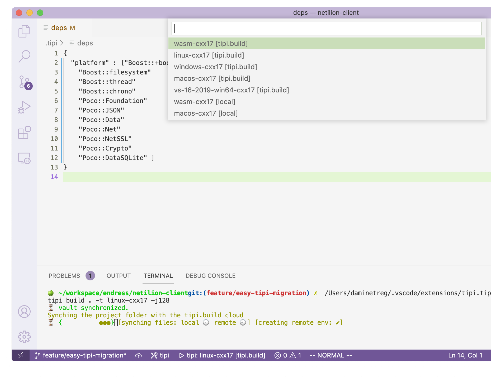

# tipi.build
Please head up to [our website](https://tipi.build)

## Features
- Provides a fully working C++ build environment on any platform
- tipi speeds up your workflow with autoprovisioned cloud environments : toolchain, compilers, tools.
- tipi is a dependency manager for C++ which fetches and compile any C++ project.
- tipi builds superfast with cloud powered build distribution that features enough RAM and Disk size.

## Flavours
Available as command line tool or vscode plugin !

## Support
* [Ask us on Github Issues](https://github.com/tipi-build/cli/issues)
* [Contact via our Website](https://tipi.build)

### Add to vscode

[Click Here to add tipi.build to vscode](https://marketplace.visualstudio.com/items?itemName=tipi.tipi-build)



### Install on Linux / macOS 
`/bin/bash -c "$(curl -fsSL https://raw.githubusercontent.com/tipi-build/cli/master/install/install_for_macos_linux.sh)"`

Paste that in a Linux shell prompt or in a macOS Terminal.

### Install on Windows 10
```
[Net.ServicePointManager]::SecurityProtocol = [Net.SecurityProtocolType]::Tls, [Net.SecurityProtocolType]::Tls11, [Net.SecurityProtocolType]::Tls12, [Net.SecurityProtocolType]::Ssl3
[Net.ServicePointManager]::SecurityProtocol = "Tls, Tls11, Tls12, Ssl3"
. { iwr -useb https://raw.githubusercontent.com/tipi-build/cli/master/install/install_for_windows.ps1 } | iex
```

Paste that in a Powershell (run as Administartor).

### Install an old version 

#### Install on Linux / macOS 
`export TIPI_INSTALL_VERSION=vx.x.x && /bin/bash -c "$(curl -fsSL https://raw.githubusercontent.com/tipi-build/cli/master/install/install_for_macos_linux.sh )"`

Paste that in a Linux shell prompt or in a macOS Terminal.

#### Install on Windows 10
```
[Net.ServicePointManager]::SecurityProtocol = [Net.SecurityProtocolType]::Tls, [Net.SecurityProtocolType]::Tls11, [Net.SecurityProtocolType]::Tls12, [Net.SecurityProtocolType]::Ssl3
[Net.ServicePointManager]::SecurityProtocol = "Tls, Tls11, Tls12, Ssl3"
$env:TIPI_INSTALL_VERSION ='vx.x.x' ; . { iwr -useb https://raw.githubusercontent.com/tipi-build/cli/master/install/install_for_windows.ps1 } | iex
```

Paste that in a Powershell (run as Administartor).


# License
Binaries delivered here are under copyright by tipi.build, see [LICENSE](./LICENSE)

Open-source projects like Boost, CMake, Emscripten, Hunter and thousands of other libraries are the giants' shoulders tipi.build is standing on. The tipi.build project is happy and truly thankful to live in a time where we can participate in such lively and creative communities with so many cool ideas and so much passion. Without those, developing tipi.build would not have been possible.

Open-source lets us take part in building the future. Let’s do it together.

Therefore in this Github organization you will find alot for tipi.build opensource contributions !
